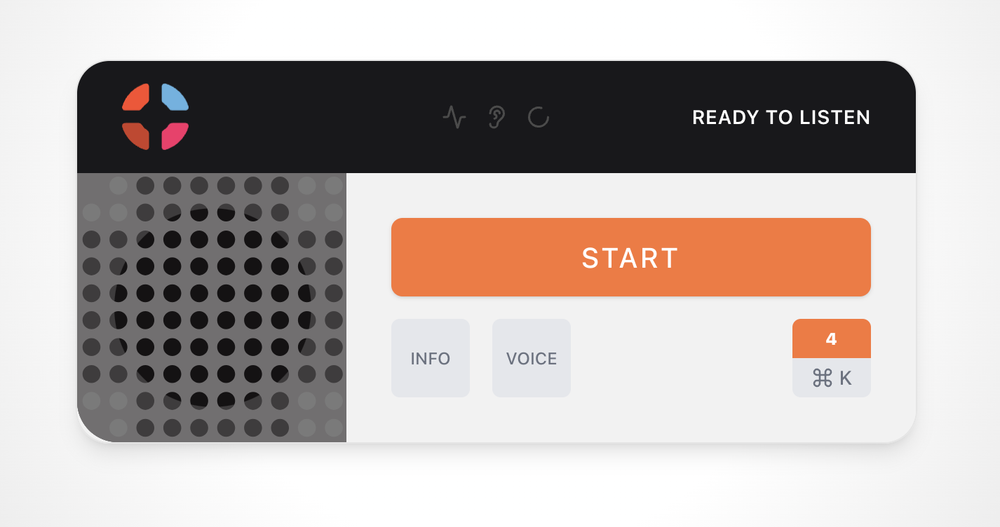

# memos

mem**os** stems from the word "memo" which is short for memorandum and OS which is short for operating system. The goal of memos is to create an operating system for your mind.

The goal of this project is to let users talk freely about their thoughts and ideas with AI agents that then organize their thoughts and ideas into a coherent structure.

The kernel of the mem**os** are readable, editable and interconnected Markdown files with a twist, they can contain actions too.

The UI is inspired by Teenage Engineering's products.

## Tech Stack

- Next.js
- Tailwind CSS
- Shadcn UI
- ElevenLabs Conversational AI
- AIM
- Vercel AI SDK

### AIM

[AIM](https://aim.tools) is a language [microchipgnu](https://x.com/microchipgnu) created. It is an AI-enhaced markup language inspired by Markdown and Markdoc. 

### Core Agent

At the end of a session, the user shares their current memos state with the core agent which in turn analyzes everything and then creates a new state.

```mermaid
sequenceDiagram
    participant Client
    participant generateAIResponse
    participant generatePlan
    participant generateChanges
    participant OpenAI

    Client->>generateAIResponse: messages[], memos[]
    
    generateAIResponse->>generatePlan: Generate implementation plan
    generatePlan->>OpenAI: Generate object with planSchema
    OpenAI-->>generatePlan: Return plan object
    generatePlan-->>generateAIResponse: Return plan
    
    Note over generateAIResponse: If no files in plan,<br/>create default memo

    generateAIResponse->>generateChanges: Generate changes for each file
    
    loop For each file in plan
        generateChanges->>OpenAI: Generate initial content
        OpenAI-->>generateChanges: Return content
        
        loop Quality improvement (max 3 iterations)
            generateChanges->>OpenAI: Evaluate content
            OpenAI-->>generateChanges: Return evaluation
            
            alt Quality criteria not met
                generateChanges->>OpenAI: Generate improved content
                OpenAI-->>generateChanges: Return improved content
            end
        end
    end
    
    generateChanges-->>generateAIResponse: Return changes array
    
    Note over generateAIResponse: Convert changes to<br/>files format
    
    generateAIResponse-->>Client: Return {files}
```

---


This is a [Next.js](https://nextjs.org) project bootstrapped with [`create-next-app`](https://nextjs.org/docs/app/api-reference/cli/create-next-app).

## Getting Started

First, run the development server:

```bash
npm run dev
# or
yarn dev
# or
pnpm dev
# or
bun dev
```

Open [http://localhost:3000](http://localhost:3000) with your browser to see the result.

You can start editing the page by modifying `app/page.tsx`. The page auto-updates as you edit the file.

This project uses [`next/font`](https://nextjs.org/docs/app/building-your-application/optimizing/fonts) to automatically optimize and load [Geist](https://vercel.com/font), a new font family for Vercel.

## Learn More

To learn more about Next.js, take a look at the following resources:

- [Next.js Documentation](https://nextjs.org/docs) - learn about Next.js features and API.
- [Learn Next.js](https://nextjs.org/learn) - an interactive Next.js tutorial.

You can check out [the Next.js GitHub repository](https://github.com/vercel/next.js) - your feedback and contributions are welcome!

## Deploy on Vercel

The easiest way to deploy your Next.js app is to use the [Vercel Platform](https://vercel.com/new?utm_medium=default-template&filter=next.js&utm_source=create-next-app&utm_campaign=create-next-app-readme) from the creators of Next.js.

Check out our [Next.js deployment documentation](https://nextjs.org/docs/app/building-your-application/deploying) for more details.
